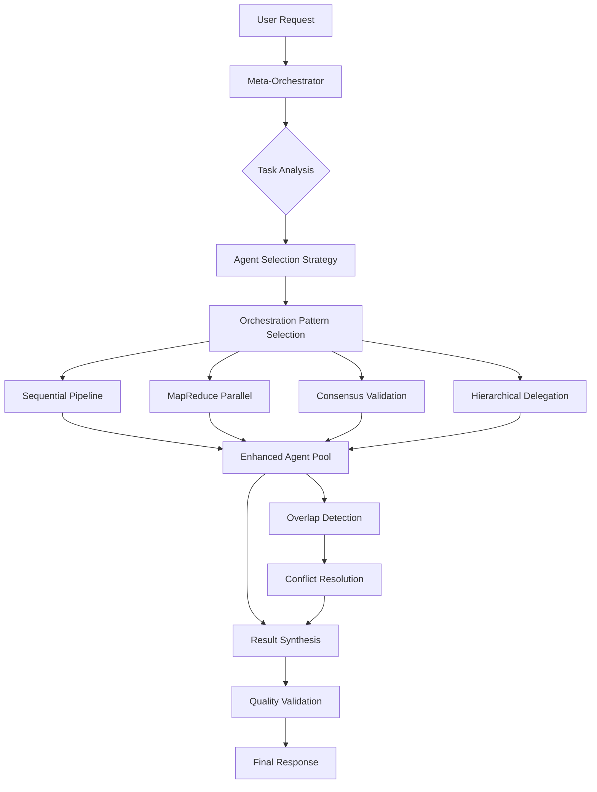

# Enhanced Agent System Architecture
*Complete Blueprint for Two-Tier Agentic AI Consulting System*

## Executive Summary

This document provides a comprehensive blueprint for transforming the existing 28-agent consulting system into an enhanced two-tier agentic AI architecture following proven best practices. The system maintains all existing expert methodologies while adding sophisticated multi-agent coordination, overlap detection, conflict resolution, and intelligent orchestration.

## Table of Contents

1. [System Architecture Overview](#system-architecture-overview)
2. [Meta-Orchestrator Design](#meta-orchestrator-design)
3. [Enhanced Individual Agent Specifications](#enhanced-individual-agent-specifications)
4. [Communication Protocols](#communication-protocols)
5. [Orchestration Patterns](#orchestration-patterns)
6. [Task Decomposition Framework](#task-decomposition-framework)
7. [Overlap Detection & Conflict Resolution](#overlap-detection--conflict-resolution)
8. [Context Management System](#context-management-system)
9. [Error Handling & Resilience](#error-handling--resilience)
10. [Performance Monitoring](#performance-monitoring)
11. [Implementation Roadmap](#implementation-roadmap)

---

## System Architecture Overview

### Current System Analysis
- **28 specialized consultant agents** with expert methodologies
- **Direct user-to-agent** consultation model
- **Category organization**: Business Strategy, Design, Technical, Content, Analysis & Operations
- **Proven methodologies**: Chris Do, Don Norman, Paula Scher, etc.

### Enhanced System Design



### Key Architectural Principles

1. **Two-Tier Model**: Meta-Orchestrator + 28 Enhanced Stateless Agents
2. **Stateless Design**: All agents are pure functions with structured I/O
3. **Intelligent Orchestration**: Pattern-based coordination strategies
4. **Overlap Management**: Automated detection and consensus resolution
5. **Context Optimization**: Minimal, relevant context passing
6. **Error Resilience**: Graceful degradation and fallback strategies

---

## Meta-Orchestrator Design

### Core Responsibilities

The Meta-Orchestrator serves as the central intelligence that coordinates all agent interactions and manages the consultation process.

#### Primary Functions

```yaml
meta_orchestrator:
  core_functions:
    - task_analysis_and_decomposition
    - agent_selection_and_coordination  
    - orchestration_pattern_selection
    - context_management_and_filtering
    - result_synthesis_and_validation
    - error_handling_and_recovery
    - overlap_detection_and_resolution
    - performance_monitoring_and_optimization
```

#### Task Analysis Engine

```yaml
task_analysis:
  components:
    complexity_assessor:
      simple: "Single domain, direct answer"
      moderate: "Multiple domains, sequential dependencies"
      complex: "Cross-domain coordination, consensus required"
    
    domain_mapper:
      primary_domain: "Main expertise area required"
      secondary_domains: "Supporting areas needed"
      overlap_zones: "Potential agent conflicts"
    
    dependency_analyzer:
      sequential: "Task A must complete before Task B"
      parallel: "Tasks can run simultaneously"
      conditional: "Task execution based on results"
```

#### Agent Selection Matrix

```yaml
agent_selection:
  selection_criteria:
    domain_relevance: 
      weight: 0.4
      calculation: "semantic_similarity(request, agent_domain)"
    
    methodology_fit:
      weight: 0.3
      calculation: "framework_alignment(request_type, agent_methodology)"
    
    complexity_match:
      weight: 0.2
      calculation: "complexity_compatibility(task_complexity, agent_capability)"
    
    availability:
      weight: 0.1
      calculation: "current_load_balance(agent_id)"
  
  selection_strategies:
    single_expert: "One agent handles entire request"
    complementary_team: "Multiple agents with different strengths"
    consensus_panel: "Multiple agents for validation"
    hierarchical_chain: "Primary agent with specialist support"
```

#### Context Management System

```yaml
context_management:
  filtering_strategy:
    relevance_scoring:
      algorithm: "semantic_similarity + keyword_matching + domain_alignment"
      threshold: 0.7
      max_context_tokens: 2000
    
    context_compression:
      summarization: "Extract key points and requirements"
      factorization: "Separate facts from opinions"
      prioritization: "Rank information by relevance"
  
  privacy_controls:
    data_isolation: "Agent-specific context boundaries"
    sensitive_data_filtering: "Remove PII and confidential info"
    audit_trails: "Track context access patterns"
```

---

## Enhanced Individual Agent Specifications

### Stateless Agent Design Template

```yaml
enhanced_agent_template:
  agent_metadata:
    id: "{agent-name}"
    version: "2.0.0"
    category: "{business|design|technical|content|analysis}"
    expert_methodology: "{expert_name_and_framework}"
    complexity_rating: "{simple|moderate|complex}"
  
  input_specification:
    required_fields:
      - task_objective
      - context_summary
      - output_requirements
    optional_fields:
      - constraints
      - success_criteria
      - reference_materials
  
  output_specification:
    structured_response:
      status: "{success|partial|failed}"
      primary_result: "Main deliverable"
      recommendations: "Actionable next steps"
      confidence_score: "0.0-1.0"
      methodology_applied: "Which frameworks used"
      follow_up_suggestions: "Related expertise needed"
  
  capabilities:
    core_expertise: ["domain_specific_skills"]
    frameworks: ["methodologies_and_tools"]
    output_types: ["consultation_formats"]
  
  performance_metrics:
    average_response_time: "Target completion time"
    success_rate: "Historical accuracy percentage"
    user_satisfaction: "Feedback score average"
```

### Enhanced Agent Transformations

#### Business Strategy & Sales Category

```yaml
enhanced_agents:
  sales_specialist:
    base_methodology: "Chris Do value-based selling"
    enhanced_capabilities:
      - price_objection_analysis
      - client_psychology_assessment
      - value_proposition_generation
      - sales_process_optimization
    
    structured_outputs:
      pricing_strategy: "Value-based pricing recommendations"
      objection_responses: "Systematic response frameworks"
      client_qualification: "Prospect scoring and analysis"
  
  pricing_strategist:
    base_methodology: "Becca Luna menu-based pricing"
    enhanced_capabilities:
      - service_packaging_analysis
      - competitive_pricing_research
      - psychological_pricing_optimization
      - revenue_model_design
  
  brand_strategist:
    base_methodology: "Strategic positioning frameworks"
    enhanced_capabilities:
      - competitive_landscape_analysis
      - brand_differentiation_strategy
      - positioning_statement_creation
      - brand_architecture_design
```

#### Design & Visual Category

```yaml
enhanced_agents:
  visual_design_specialist:
    base_methodology: "Massimo Vignelli systematic design"
    enhanced_capabilities:
      - color_palette_generation
      - typography_hierarchy_analysis
      - spacing_system_calculation
      - design_system_validation
    
    structured_outputs:
      design_system: "Complete visual system specifications"
      color_analysis: "Psychological and accessibility assessment"
      typography_guide: "Hierarchical type system"
  
  ux_interaction_specialist:
    base_methodology: "Don Norman human-centered design"
    enhanced_capabilities:
      - usability_heuristic_evaluation
      - interaction_pattern_analysis
      - accessibility_assessment
      - user_flow_optimization
```

#### Technical & Architecture Category

```yaml
enhanced_agents:
  frontend_architecture_specialist:
    base_methodology: "Scalable CSS and component architecture"
    enhanced_capabilities:
      - code_architecture_analysis
      - performance_bottleneck_detection
      - build_process_optimization
      - component_structure_validation
    
    structured_outputs:
      architecture_plan: "Scalable code organization strategy"
      performance_audit: "Bottleneck identification and solutions"
      build_optimization: "Compilation and deployment improvements"
  
  accessibility_specialist:
    base_methodology: "WCAG compliance and inclusive design"
    enhanced_capabilities:
      - wcag_compliance_audit
      - screen_reader_optimization
      - keyboard_navigation_analysis
      - color_contrast_validation
```

---

## Communication Protocols

### Structured Task Specification

```yaml
task_specification_schema:
  version: "2.0"
  structure:
    header:
      task_id: "unique_identifier"
      timestamp: "ISO_8601_format"
      priority: "low|medium|high|urgent"
      estimated_complexity: "simple|moderate|complex"
    
    objective:
      description: "Clear, specific task description"
      success_criteria: "Measurable completion indicators"
      output_format: "Expected result structure"
    
    context:
      user_background: "Relevant user information"
      business_context: "Industry and company details" 
      technical_constraints: "Limitations and requirements"
      reference_materials: "Supporting documents or data"
    
    constraints:
      time_limit: "Maximum processing time"
      resource_limits: "Computational boundaries"
      privacy_requirements: "Data handling restrictions"
      compliance_needs: "Regulatory considerations"
    
    routing_metadata:
      primary_agents: "Main expertise required"
      secondary_agents: "Supporting capabilities needed"
      orchestration_pattern: "Coordination strategy"
      overlap_risk: "Potential conflict areas"
```

### Structured Response Schema

```yaml
agent_response_schema:
  version: "2.0"
  structure:
    header:
      agent_id: "responding_agent_identifier"
      task_id: "corresponding_request_id"
      response_timestamp: "completion_time"
      processing_duration: "execution_time_ms"
    
    status:
      execution_status: "success|partial|failed"
      confidence_level: "0.0-1.0_confidence_score"
      completeness: "percentage_of_task_completed"
    
    primary_result:
      deliverable: "Main task output"
      methodology_applied: "Frameworks and approaches used"
      key_insights: "Important findings or observations"
      actionable_recommendations: "Specific next steps"
    
    metadata:
      resources_used:
        model_type: "AI model utilized"
        token_count: "Computational resources consumed"
        processing_complexity: "Actual vs estimated complexity"
      
      quality_indicators:
        self_assessment: "Agent's confidence in output"
        validation_checks: "Internal quality controls passed"
        edge_cases_considered: "Boundary conditions addressed"
    
    follow_up:
      related_expertise: "Other agents that could help"
      unanswered_questions: "Areas requiring additional research"
      recommendations: "Suggested next steps or iterations"
      potential_conflicts: "Areas where other agents might disagree"
    
    errors:
      encountered_issues: "Problems during processing"
      workarounds_applied: "How issues were addressed"
      limitations: "What couldn't be accomplished"
      retry_suggestions: "How to improve next attempt"
```

### Inter-Agent Communication Protocol

```yaml
inter_agent_communication:
  message_types:
    consultation_request:
      from_agent: "requesting_agent_id"
      to_agent: "target_agent_id"
      request_type: "expertise_needed"
      context_summary: "relevant_background"
      specific_question: "focused_inquiry"
    
    consensus_voting:
      coordinator: "orchestrator_id"
      participants: ["agent_ids"]
      decision_point: "specific_disagreement"
      options: ["possible_solutions"]
      voting_criteria: "decision_framework"
    
    result_validation:
      validator: "checking_agent_id"
      original_agent: "primary_responder_id"
      validation_criteria: "quality_checks"
      feedback: "improvement_suggestions"
```

---

## Orchestration Patterns

### Pattern Selection Logic

```yaml
orchestration_pattern_selection:
  decision_matrix:
    task_complexity:
      simple: 
        pattern: "single_agent"
        description: "One expert handles entire request"
      
      moderate:
        pattern: "sequential_pipeline"
        description: "Multi-step process with dependencies"
      
      complex:
        pattern: "consensus_validation"
        description: "Multiple experts with conflict resolution"
      
      very_complex:
        pattern: "hierarchical_coordination"
        description: "Supervisor agents with specialist teams"
    
    domain_overlap:
      none:
        pattern: "parallel_execution"
        description: "Independent agents work simultaneously"
      
      moderate:
        pattern: "mapreduce_aggregation"
        description: "Parallel work with intelligent synthesis"
      
      high:
        pattern: "consensus_resolution"
        description: "Collaborative decision making"
    
    quality_requirements:
      standard:
        pattern: "single_expert"
        description: "Trust individual agent expertise"
      
      high:
        pattern: "peer_validation"
        description: "Secondary agent reviews output"
      
      critical:
        pattern: "consensus_panel"
        description: "Multiple experts must agree"
```

### Implementation Patterns

#### Sequential Pipeline
```yaml
sequential_pipeline:
  description: "Linear progression through multiple agents"
  use_cases:
    - "Multi-step project planning"
    - "Progressive refinement processes"
    - "Dependent task completion"
  
  implementation:
    stage_definition:
      - agent_selection
      - context_preparation
      - execution_order
      - handoff_protocols
    
    error_handling:
      - stage_rollback
      - alternative_routing
      - quality_gates
  
  example_flow:
    user_request: "Complete brand identity project"
    stages:
      1. brand_strategist: "Develop positioning strategy"
      2. visual_design_specialist: "Create visual system"
      3. copywriter: "Develop brand voice"
      4. web_design_specialist: "Apply to digital presence"
```

#### MapReduce Pattern
```yaml
mapreduce_pattern:
  description: "Parallel processing with intelligent aggregation"
  use_cases:
    - "Comprehensive analysis from multiple perspectives"
    - "Rapid research across domains"
    - "Creative ideation with diverse inputs"
  
  implementation:
    map_phase:
      agent_selection: "Multiple relevant specialists"
      task_distribution: "Parallel identical or related tasks"
      isolation: "Prevent cross-contamination"
    
    reduce_phase:
      synthesis_agent: "Meta-orchestrator or specialist"
      conflict_resolution: "Consensus or hierarchical"
      quality_validation: "Coherence and completeness"
  
  example_flow:
    user_request: "Comprehensive website audit"
    map_agents:
      - performance_specialist: "Technical performance"
      - ux_interaction_specialist: "User experience"
      - seo_specialist: "Search optimization"
      - accessibility_specialist: "Compliance check"
    reduce_phase:
      - conflict_identification
      - priority_ranking
      - integrated_action_plan
```

#### Consensus Validation
```yaml
consensus_validation:
  description: "Multiple experts collaborate on complex decisions"
  use_cases:
    - "Strategic business decisions"
    - "Design direction approval" 
    - "Technical architecture choices"
  
  implementation:
    participant_selection:
      primary_experts: "Domain specialists"
      supporting_voices: "Adjacent expertise"
      maximum_participants: 5
    
    consensus_process:
      independent_analysis: "Separate initial assessments"
      structured_discussion: "Facilitated comparison"
      conflict_resolution: "Systematic disagreement handling"
      final_validation: "Group agreement verification"
  
  voting_mechanisms:
    simple_majority: ">50% agreement required"
    qualified_majority: "2/3 agreement required"
    unanimous: "100% agreement required"
    weighted_voting: "Expertise-based vote weighting"
```

#### Hierarchical Delegation
```yaml
hierarchical_delegation:
  description: "Supervisor agents coordinate specialist teams"
  use_cases:
    - "Large multi-domain projects"
    - "Complex organizational challenges"
    - "Long-term strategic initiatives"
  
  implementation:
    hierarchy_structure:
      meta_orchestrator: "Overall coordination"
      domain_supervisors: "Category-level coordination"
      specialist_agents: "Specific task execution"
    
    coordination_protocols:
      task_breakdown: "Hierarchical decomposition"
      progress_reporting: "Bottom-up status updates"
      resource_allocation: "Top-down priority setting"
  
  example_structure:
    project: "Complete digital transformation"
    meta_orchestrator: "Overall project coordination"
    domain_supervisors:
      - business_strategy_lead: "Strategic planning"
      - technical_lead: "Architecture and implementation"
      - design_lead: "User experience and visual design"
    specialists: "Individual expert contributions"
```

---

## Task Decomposition Framework

### Decomposition Strategies

#### Vertical Decomposition (Sequential)
```yaml
vertical_decomposition:
  description: "Break complex tasks into dependent sequential steps"
  identification_criteria:
    - natural_progression_exists
    - output_dependencies_present
    - quality_gates_required
  
  decomposition_process:
    task_analysis:
      - identify_major_phases
      - map_dependencies
      - define_handoff_points
    
    agent_assignment:
      - match_expertise_to_phase
      - ensure_methodology_continuity
      - plan_context_transfer
  
  example:
    original_task: "Launch new service offering"
    decomposed_phases:
      1. market_research: "competitive_analyst + user_researcher"
      2. service_design: "business_development_specialist"
      3. pricing_strategy: "pricing_strategist" 
      4. marketing_plan: "marketing_strategist + copywriter"
      5. sales_process: "sales_specialist + proposal_specialist"
```

#### Horizontal Decomposition (Parallel)
```yaml
horizontal_decomposition:
  description: "Divide tasks into independent parallel streams"
  identification_criteria:
    - components_can_work_independently
    - minimal_interdependencies
    - aggregation_possible
  
  decomposition_process:
    task_splitting:
      - identify_independent_aspects
      - ensure_complete_coverage
      - prevent_overlap_conflicts
    
    parallel_coordination:
      - synchronized_start
      - progress_monitoring
      - coordinated_completion
  
  example:
    original_task: "Complete website redesign"
    parallel_streams:
      - content_strategy: "content_strategist + copywriter"
      - visual_design: "visual_design_specialist + brand_designer"
      - technical_architecture: "frontend_architecture_specialist"
      - user_experience: "ux_interaction_specialist + user_researcher"
      - performance_optimization: "performance_specialist + seo_specialist"
```

### Task Classification System

```yaml
task_classification:
  complexity_levels:
    simple:
      characteristics:
        - single_domain_expertise
        - clear_success_criteria
        - minimal_dependencies
      agent_strategy: "single_expert"
      examples: ["Price a specific service", "Review copy for tone"]
    
    moderate:
      characteristics:
        - multi_domain_expertise
        - some_interdependencies
        - standard_complexity
      agent_strategy: "sequential_or_parallel"
      examples: ["Design complete brand identity", "Optimize website performance"]
    
    complex:
      characteristics:
        - cross_domain_coordination
        - high_interdependencies
        - strategic_implications
      agent_strategy: "consensus_or_hierarchical"
      examples: ["Plan digital transformation", "Resolve major client crisis"]
    
  domain_mapping:
    single_domain:
      business: ["sales_specialist", "pricing_strategist", "brand_strategist"]
      design: ["visual_design_specialist", "brand_designer", "ux_interaction_specialist"]
      technical: ["frontend_architecture_specialist", "performance_specialist"]
      content: ["copywriter", "content_strategist", "marketing_strategist"]
      analysis: ["user_researcher", "competitive_analyst", "financial_analyst"]
    
    cross_domain_common_pairs:
      business_design: ["brand_strategist", "visual_design_specialist"]
      design_technical: ["ux_interaction_specialist", "frontend_architecture_specialist"]
      content_marketing: ["copywriter", "marketing_strategist", "social_media_specialist"]
      analysis_strategy: ["competitive_analyst", "business_development_specialist"]
```

---

## Overlap Detection & Conflict Resolution

### Overlap Detection System

```yaml
overlap_detection:
  domain_mapping:
    expertise_boundaries:
      sales_pricing_overlap:
        agents: ["sales_specialist", "pricing_strategist"]
        overlap_areas: ["value_positioning", "objection_handling"]
        resolution_strategy: "consensus_with_sales_lead"
      
      design_brand_overlap:
        agents: ["visual_design_specialist", "brand_designer", "brand_strategist"]
        overlap_areas: ["visual_identity", "brand_expression"]
        resolution_strategy: "hierarchical_brand_strategist_lead"
      
      content_marketing_overlap:
        agents: ["copywriter", "content_strategist", "marketing_strategist"]
        overlap_areas: ["messaging", "content_planning"]
        resolution_strategy: "mapreduce_synthesis"
    
    automated_detection:
      semantic_analysis:
        algorithm: "embedding_similarity"
        threshold: 0.8
        confidence_requirement: 0.9
      
      keyword_monitoring:
        overlap_indicators: ["pricing", "brand", "content", "design", "strategy"]
        context_analysis: "determine_primary_vs_supporting_role"
      
      methodology_conflicts:
        framework_incompatibility: "identify_contradictory_approaches"
        priority_disagreements: "flag_different_success_criteria"
```

### Consensus Resolution Model

```yaml
consensus_resolution:
  conflict_types:
    methodology_disagreement:
      description: "Different expert approaches to same problem"
      resolution_process:
        1. independent_analysis: "Each agent provides reasoning"
        2. structured_comparison: "Compare approaches systematically"
        3. synthesis_attempt: "Find complementary elements"
        4. expert_arbitration: "Meta-orchestrator decides if needed"
      
      example:
        conflict: "Pricing strategy disagreement"
        agents: ["sales_specialist", "pricing_strategist"]
        sales_view: "Value-based pricing with relationship focus"
        pricing_view: "Menu-based pricing with clear options"
        synthesis: "Hybrid approach with value-based discovery + menu presentation"
    
    priority_conflicts:
      description: "Different ranking of objectives or concerns"
      resolution_process:
        1. objective_clarification: "Clarify user's primary goals"
        2. priority_ranking: "Score each concern by importance"
        3. weighted_synthesis: "Combine approaches by priority"
        4. implementation_sequencing: "Plan phased approach"
    
    factual_disagreements:
      description: "Different interpretations of data or requirements"
      resolution_process:
        1. evidence_gathering: "Collect supporting information"
        2. source_validation: "Verify information reliability"
        3. expert_verification: "Consult additional specialists"
        4. consensus_building: "Agree on verified facts"
  
  voting_mechanisms:
    confidence_weighted:
      formula: "vote_weight = confidence_score * expertise_relevance"
      threshold: "weighted_majority > 0.6"
    
    methodology_alignment:
      formula: "weight = methodology_fit * historical_success"
      application: "favor_agents_with_proven_frameworks"
    
    user_preference:
      consideration: "incorporate_user_stated_preferences"
      weight: "user_preference_multiplier = 1.5"
```

---

## Context Management System

### Context Filtering Strategy

```yaml
context_management:
  filtering_principles:
    relevance_maximization:
      semantic_similarity: "content_relevance_to_agent_domain"
      recency_weighting: "prioritize_recent_information"
      specificity_scoring: "prefer_specific_over_general"
    
    noise_reduction:
      redundancy_elimination: "remove_duplicate_information"
      tangent_filtering: "remove_off_topic_content"
      speculation_removal: "focus_on_facts_and_requirements"
  
  context_preparation_by_agent_type:
    business_strategy_agents:
      essential_context:
        - business_model_and_revenue
        - target_market_and_customers
        - competitive_landscape
        - growth_objectives
        - current_challenges
      
      filtered_out:
        - technical_implementation_details
        - design_preferences
        - detailed_analytics_data
    
    design_agents:
      essential_context:
        - brand_guidelines_and_identity
        - target_audience_demographics
        - design_preferences_and_constraints
        - existing_visual_assets
        - platform_requirements
      
      filtered_out:
        - detailed_financial_information
        - technical_architecture_specifics
        - operational_procedures
    
    technical_agents:
      essential_context:
        - current_technology_stack
        - performance_requirements
        - scalability_needs
        - integration_constraints
        - security_requirements
      
      filtered_out:
        - marketing_strategy_details
        - visual_design_preferences
        - sales_process_information
```

### Context Compression Techniques

```yaml
context_compression:
  summarization_strategies:
    extractive_summarization:
      method: "identify_key_sentences_and_facts"
      target_reduction: "50-70%"
      preservation_priority: "requirements > constraints > background"
    
    abstractive_summarization:
      method: "rewrite_in_concise_form"
      target_reduction: "60-80%"
      focus: "essential_meaning_and_actionable_information"
    
    hierarchical_compression:
      level_1: "core_requirements_and_objectives"
      level_2: "important_constraints_and_context"
      level_3: "nice_to_know_background_information"
      adaptive_depth: "expand_levels_based_on_agent_needs"
  
  context_caching:
    user_profile_cache:
      business_context: "industry, company_size, market_position"
      preferences: "communication_style, priority_areas"
      history: "previous_consultations_and_outcomes"
    
    project_context_cache:
      current_state: "existing_assets_and_systems"
      objectives: "goals_and_success_criteria"
      constraints: "budget_timeline_technical_limitations"
    
    session_context:
      conversation_flow: "previous_questions_and_answers"
      decisions_made: "choices_and_rationale"
      outstanding_items: "unresolved_questions_and_todos"
```

---

## Error Handling & Resilience

### Graceful Degradation Strategy

```yaml
error_handling:
  failure_classification:
    agent_unavailable:
      cause: "Agent overloaded or maintenance"
      response: "Route to backup agent with similar expertise"
      fallback: "Queue for retry when agent available"
    
    incomplete_context:
      cause: "Missing required information for quality response"
      response: "Request specific clarification from user"
      fallback: "Provide best-effort response with caveats"
    
    methodology_conflict:
      cause: "Irreconcilable disagreement between expert approaches"
      response: "Present multiple options with trade-offs"
      fallback: "Meta-orchestrator makes informed decision"
    
    quality_threshold_failure:
      cause: "Agent response doesn't meet confidence requirements"
      response: "Engage additional agents for validation"
      fallback: "Return response with quality warnings"
  
  degradation_levels:
    full_service:
      description: "All agents available, complete orchestration"
      user_experience: "Optimal consultation quality"
    
    reduced_service:
      description: "Some agents unavailable, alternative routing"
      user_experience: "Slight delay, equivalent expertise"
    
    essential_service:
      description: "Limited agents, simplified orchestration"
      user_experience: "Basic consultation, clear limitations"
    
    emergency_service:
      description: "Single agent fallback, minimal orchestration"
      user_experience: "Direct expert consultation only"
```

### Retry and Recovery Mechanisms

```yaml
retry_strategies:
  exponential_backoff:
    initial_delay: "1_second"
    max_delay: "30_seconds"
    multiplier: 2.0
    max_attempts: 3
    jitter: "random_0_to_25_percent"
  
  circuit_breaker:
    failure_threshold: 5
    timeout_period: "60_seconds"
    half_open_test_requests: 3
    success_threshold_for_close: 2
  
  alternative_routing:
    agent_substitution:
      similar_expertise: "Route to agent with overlapping domain"
      reduced_capability: "Use more general agent with caveats"
      human_escalation: "Flag for manual review if available"
    
    pattern_fallback:
      consensus_to_single: "Single expert instead of panel"
      parallel_to_sequential: "Sequential processing if parallel fails"
      complex_to_simple: "Simplified approach with clear limitations"
```

---

## Performance Monitoring

### Key Performance Indicators

```yaml
performance_metrics:
  system_level:
    availability:
      target: "99.5%_uptime"
      measurement: "successful_requests / total_requests"
      alert_threshold: "< 99.0%"
    
    response_time:
      target: "< 2_seconds_average"
      measurement: "p95_response_time_per_request"
      alert_threshold: "> 5_seconds"
    
    throughput:
      target: "100_consultations_per_hour"
      measurement: "completed_requests_per_time_unit"
      alert_threshold: "< 50_per_hour"
  
  agent_level:
    individual_performance:
      success_rate:
        target: "> 95%"
        measurement: "successful_completions / total_attempts"
      
      response_quality:
        target: "> 4.5/5.0"
        measurement: "user_satisfaction_score"
      
      efficiency:
        target: "< 30_seconds_per_task"
        measurement: "average_processing_time"
    
    orchestration_metrics:
      pattern_effectiveness:
        measurement: "success_rate_by_orchestration_pattern"
        optimization: "adjust_pattern_selection_logic"
      
      conflict_resolution:
        measurement: "consensus_time + user_satisfaction"
        optimization: "improve_overlap_detection_accuracy"
```

### Monitoring Dashboard Design

```yaml
monitoring_dashboard:
  real_time_view:
    active_consultations:
      display: "current_requests_by_status"
      metrics: ["in_progress", "waiting", "completed"]
    
    agent_utilization:
      display: "current_load_per_agent"
      visualization: "heatmap_by_category"
    
    system_health:
      display: "key_metrics_status"
      indicators: ["availability", "response_time", "error_rate"]
  
  historical_analysis:
    trend_analysis:
      timeframes: ["hourly", "daily", "weekly", "monthly"]
      metrics: ["usage_patterns", "performance_trends", "quality_scores"]
    
    pattern_effectiveness:
      analysis: "orchestration_pattern_success_rates"
      optimization_suggestions: "pattern_selection_improvements"
    
    agent_performance:
      comparison: "individual_agent_metrics"
      insights: "strength_and_improvement_areas"
```

---

## Implementation Roadmap

### Phase 1: Foundation Architecture (Weeks 1-4)

```yaml
phase_1_foundation:
  objectives:
    - implement_meta_orchestrator_core
    - create_enhanced_agent_framework
    - establish_communication_protocols
    - build_basic_monitoring
  
  deliverables:
    meta_orchestrator:
      - task_analysis_engine
      - agent_selection_logic
      - basic_orchestration_patterns
    
    enhanced_agents:
      - stateless_agent_template
      - structured_io_implementation  
      - first_5_transformed_agents
    
    communication:
      - yaml_schema_validation
      - message_routing_system
      - basic_error_handling
    
    monitoring:
      - performance_metrics_collection
      - basic_dashboard_implementation
      - alerting_system_setup
  
  success_criteria:
    - basic_two_tier_system_operational
    - simple_single_agent_consultations_working
    - structured_communication_validated
    - performance_monitoring_active
```

### Phase 2: Agent Transformation (Weeks 5-8)

```yaml
phase_2_agents:
  objectives:
    - transform_all_28_agents_to_enhanced_format
    - implement_domain_expertise_validation
    - create_agent_testing_framework
    - establish_quality_baselines
  
  deliverables:
    agent_transformation:
      - all_28_agents_enhanced_and_tested
      - methodology_preservation_validated
      - performance_benchmarks_established
    
    testing_framework:
      - automated_agent_validation
      - consistency_testing_suite
      - regression_testing_capabilities
    
    quality_assurance:
      - expert_methodology_accuracy
      - response_quality_standards
      - user_satisfaction_baselines
  
  success_criteria:
    - all_agents_pass_validation_tests
    - expert_methodology_fidelity_maintained
    - performance_meets_baseline_requirements
    - user_satisfaction_above_4.0/5.0
```

### Phase 3: Advanced Orchestration (Weeks 9-12)

```yaml
phase_3_orchestration:
  objectives:
    - implement_all_orchestration_patterns
    - create_task_decomposition_system
    - build_overlap_detection_and_resolution
    - establish_context_management
  
  deliverables:
    orchestration_patterns:
      - sequential_pipeline_implementation
      - mapreduce_parallel_processing
      - consensus_validation_system
      - hierarchical_delegation_framework
    
    task_management:
      - automatic_task_decomposition
      - dependency_analysis_engine
      - intelligent_pattern_selection
    
    conflict_resolution:
      - overlap_detection_system
      - consensus_building_mechanisms
      - automated_conflict_resolution
    
    context_optimization:
      - intelligent_context_filtering
      - agent_specific_context_preparation
      - context_compression_algorithms
  
  success_criteria:
    - all_orchestration_patterns_functional
    - complex_multi_agent_consultations_successful
    - conflict_resolution_accuracy_above_90%
    - context_relevance_scores_above_0.8
```

### Phase 4: Optimization & Resilience (Weeks 13-16)

```yaml
phase_4_optimization:
  objectives:
    - implement_performance_optimizations
    - create_comprehensive_error_handling
    - establish_production_resilience
    - optimize_resource_utilization
  
  deliverables:
    performance_optimization:
      - intelligent_caching_system
      - parallel_execution_optimization
      - model_selection_optimization
      - resource_pooling_implementation
    
    error_handling:
      - graceful_degradation_system
      - comprehensive_retry_mechanisms
      - circuit_breaker_implementation
      - alternative_routing_logic
    
    resilience:
      - failover_mechanisms
      - disaster_recovery_procedures
      - data_backup_and_recovery
      - security_hardening
  
  success_criteria:
    - system_availability_above_99.5%
    - error_recovery_success_above_98%
    - performance_optimization_30%_improvement
    - security_audit_compliance
```

### Phase 5: Production Launch (Weeks 17-20)

```yaml
phase_5_launch:
  objectives:
    - conduct_comprehensive_system_testing
    - implement_production_monitoring
    - create_user_documentation_and_training
    - execute_controlled_production_rollout
  
  deliverables:
    testing_validation:
      - load_testing_and_scalability_validation
      - security_penetration_testing
      - user_acceptance_testing
      - business_continuity_testing
    
    production_readiness:
      - comprehensive_monitoring_dashboard
      - automated_alerting_and_response
      - operational_runbooks
      - support_escalation_procedures
    
    documentation:
      - user_guides_and_tutorials
      - system_administration_documentation
      - troubleshooting_guides
      - api_documentation
    
    rollout:
      - controlled_beta_launch
      - gradual_user_migration
      - feedback_collection_and_analysis
      - system_optimization_based_on_usage
  
  success_criteria:
    - production_system_stability_validated
    - user_satisfaction_above_4.5/5.0
    - business_objectives_met
    - system_ready_for_full_scale_operation
```

---

## Success Metrics & Validation

### Technical Success Criteria

```yaml
technical_metrics:
  system_reliability:
    availability: "> 99.5% uptime"
    error_rate: "< 0.5% failed requests"
    recovery_time: "< 30 seconds from failure"
  
  performance:
    response_time: "< 2 seconds average"
    throughput: "> 100 consultations/hour"
    resource_efficiency: "30% cost reduction vs current"
  
  quality:
    agent_accuracy: "> 95% methodology fidelity"
    conflict_resolution: "> 90% successful consensus"
    context_relevance: "> 0.8 relevance score"
```

### Business Success Criteria

```yaml
business_metrics:
  user_satisfaction:
    consultation_quality: "> 4.5/5.0 rating"
    response_completeness: "> 4.0/5.0 rating"
    system_ease_of_use: "> 4.0/5.0 rating"
  
  operational_efficiency:
    consultation_speed: "40% faster completion"
    expert_utilization: "> 80% agent efficiency"
    cost_per_consultation: "25% reduction"
  
  business_impact:
    user_adoption: "> 90% of users engage with system"
    retention: "> 95% continued usage"
    value_delivery: "measurable business outcomes"
```

---

## Conclusion

This enhanced agent system architecture transforms the existing 28-agent consulting stable into a sophisticated two-tier agentic AI system while preserving the proven expert methodologies that make each agent valuable. The system provides:

1. **Intelligent Orchestration**: Automatic pattern selection and multi-agent coordination
2. **Quality Assurance**: Overlap detection and conflict resolution through consensus
3. **Scalable Architecture**: Stateless agents with optimized context management
4. **Resilient Operation**: Comprehensive error handling and graceful degradation
5. **Performance Optimization**: Intelligent caching, parallel processing, and resource management

The implementation roadmap provides a clear path from the current direct consultation model to a fully orchestrated multi-agent system that can handle complex, cross-domain consulting challenges while maintaining the high-quality, methodology-based advice that users expect.

This blueprint serves as a complete specification for building a production-ready enhanced agent system that follows proven agentic AI best practices while respecting the unique value proposition of expert-methodology-based consultation.